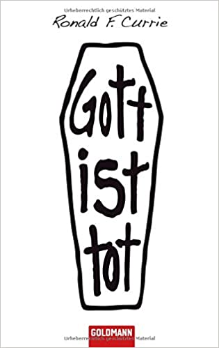

```{r setup, include=FALSE}
knitr::opts_chunk$set(echo = FALSE)
packages.used=c("tidyverse", "tokenizers", "tidytext", 
                "tm", "forcats", "devtools", "cowplot")

# check packages that need to be installed.
packages.needed=setdiff(packages.used, 
                        intersect(installed.packages()[,1], 
                                  packages.used))
# install additional packages
if(length(packages.needed)>0){
  install.packages(packages.needed, dependencies = TRUE)
}

devtools::install_github("gadenbuie/ggpomological")

library(tidyverse)
library(tokenizers)
library(tidytext)
library(tm)
library(forcats)
library(devtools)
library(ggpomological)
library(cowplot)


print(R.version)

```

## God vs Reason

> God is dead. God remains dead. And we have killed him. How shall we comfort ourselves, the murderers of all murderers? What was holiest and mightiest of all that the world has yet owned has bled to death under our knives: who will wipe this blood off us? What water is there for us to clean ourselves? What festivals of atonement, what sacred games shall we have to invent? Is not the greatness of this deed too great for us? Must we ourselves not become gods simply to appear worthy of it?




This quote from Friedrich Nietzsche, one of the featured authors in this data story had a profound impact on the field of philosophy. It marked a changing point in the tools that were at the disposal of theorists and the ways to describe various ideals. Philosophy is often used as a broad description for applying critical thinking and logical analysis. What gives the world meaning and what is the nature of reality itself? Questioning the very nature of things often not explainable through science itself. This data story explores the gradual change in philosophy away from using God and religion explain these broader topics.


```{r echo=FALSE, message=FALSE, warning=FALSE}
philosophy_data <- read_csv("../data/philosophy_data.csv") %>%  
  mutate(century = case_when(between(original_publication_date, 1600, 1699) ~ 17,
                             between(original_publication_date, 1700, 1799) ~ 18,
                             between(original_publication_date, 1800, 1899) ~ 19,
                             between(original_publication_date, 1900, 1999) ~ 20)) 

titles <- philosophy_data %>% 
  select(title) %>% 
  distinct(title)

authors <- philosophy_data %>% 
  select(author) %>% 
  distinct(author)

dates <- philosophy_data %>% 
  distinct(original_publication_date) 


philosophy_data_tokens <- philosophy_data %>% 
  unnest_tokens(word, sentence_str)

centuries_title <- philosophy_data %>% 
  distinct(title, century) 

centuries_author <- philosophy_data %>% 
  distinct(author, century) 


names <- philosophy_data %>% 
  distinct(title,author, original_publication_date) 

book_wordcount <- philosophy_data_tokens %>% 
  group_by(title) %>% 
  count() 

philosophy_data_tokens <- full_join(philosophy_data_tokens, book_wordcount, by = "title")


```


Using a dataset of philosophical texts that span 36 authors and are primarily dates between the beginning of the 17th century and the end of the 20th century. The first question that seems reasonable to analyze when focusing on religion versus reasoning as an infrastructure for explaining concepts is what concepts are these philosophers discussing. Using n-grams and removing the stop words of the dataset, we can see the post popular topics that plague our philosophers. 


```{r echo=FALSE, message=FALSE, warning=FALSE}
count_all <- philosophy_data_tokens %>% 
  anti_join(stop_words)  %>% 
  count(word, sort = TRUE) %>% 
  filter(n > 6200) %>% 
  mutate(word = reorder(word, n))  
  


count_all_graph <- ggplot(count_all) + 
  aes(x = n,y = word) + 
  geom_col() +
  labs(y = NULL) +
  xlab("Number of instances") + 
  ggtitle("Favorite topics of philosophers")


count_all_graph + theme_pomological()


```

These all seem characteristic for what you imagine when you hear philosophy. A larger discussion of time, or nature or the world as a whole. Trying to find reason and form in a feeling of randomness. Of the top 15 words, God is noticeably on the list. Upon inspection, god is often used as a way of describing why things are the way they are. For example, Leibniz, a protestant writes:

> “God is an absolutely perfect being”; “power and knowledge are perfections, and, insofar as they belong to God, they do not have limits”;


One of the ways that this transition can begin to present itself is a radical shift in the way authors discuss the topics. Authors like Nietzsche, Descartes and Berkeley begin to use plural prounouns and group speech as a way of communicating meaning. We, our, collective and more are words that begin to associate the power rather than I or me. It marks a notable transition in the way that meaning is produced. 

```{r echo=FALSE, message=FALSE, warning=FALSE}
bigrams <- philosophy_data %>% 
  unnest_tokens(bigram, sentence_spacy, token = "ngrams", n = 2)

bigram_count <- bigrams %>% 
  count(bigram, sort = TRUE)

# bigrams_filtered <- bigrams %>% 
#   separate(bigram, c("word1", "word2"), sep = " ") %>% 
#   filter(!word1 %in% stop_words$word) %>% 
#   filter(!word2 %in% stop_words$word) %>% 
#   count(word1, word2, sort = TRUE) %>% 
#   ggplot(aes(x = n, y = word)) +   
#     aes(x = n,y = word) + 
#     geom_col() +
#     labs(y = NULL) +
#     xlab("Number of instances") + 
#     ggtitle("Favorite topics of philosophers") + 
#     theme()


```


```{r echo=FALSE, message=FALSE, warning=FALSE}


#trigrams <- philosophy_data %>% 
#  unnest_tokens(trigram, sentence_spacy, token = "ngrams", n = 3) %>% 
#  separate(trigram, c("word1", "word2", "word3"), sep = " ") %>% 
#  count(word1, word2, word3, sort = TRUE)

```

```{r echo=FALSE, message=FALSE, warning=FALSE}

we_sums <- philosophy_data_tokens %>% 
  filter(word == "we" ) %>% 
  group_by(title) %>% 
  count(word)


i_sums <- philosophy_data_tokens %>% 
  filter(word == "I" | word == "i") %>% 
  group_by(title) %>% 
  count(word)

sums <- full_join(we_sums, i_sums, by = "title") %>% 
  select(title, n.x, n.y) %>% 
  rename("number_of_we" = n.x) %>% 
  rename("number_of_I" = n.y)

sums <- full_join(sums, names, by = "title") %>% 
  select(author, title, number_of_we, number_of_I)


#ggplot(data = sums, aes(x = number_of_we, y = number_of_I, label = author)) + 
#  geom_point() + 
#  geom_text(vjust = -1) + 
#  geom_abline(mapping = NULL, slope = 1)+ 
#  theme_minimal()

firstperson_frequency <- full_join(sums, book_wordcount, by = "title") %>% 
  mutate(frequency_we = number_of_we / n) %>% 
  mutate(frequency_I = number_of_I / n) 

firstperson_frequency <- full_join(firstperson_frequency, centuries_author, by = "author")


ggplot(data = firstperson_frequency, aes(x = frequency_we, y = frequency_I, label = author, color = century)) + 
  geom_point() + 
  geom_text(vjust = -1) + 
  geom_abline(mapping = NULL, slope = 1)+ 
  xlab("Singular Pronouns Frequeency") + 
  ylab("Plural Pronouns Frequency") + 
  ggtitle("Differences in class speech")+
  theme_pomological() 
  


```


```{r echo=FALSE, message=FALSE, warning=FALSE}
plural_sums <- philosophy_data_tokens %>% 
  filter(word == "we" | word == "our" | word == "us" | word == "collective") %>% 
  group_by(title)  %>% 
  count(word) %>% 
  group_by(title) %>% 
  summarise(total = sum(n))

singular_sums <- philosophy_data_tokens %>% 
  filter(word == "I" | word == "i" | word == "my" | word == "mine") %>% 
  group_by(title) %>% 
  count(word) %>% 
  group_by(title) %>% 
  summarise(total = sum(n))


firstperson_sums <- full_join(plural_sums, singular_sums, by = "title") %>% 
  select(title, total.x, total.y) %>% 
  rename("plural" = total.x) %>% 
  rename("singular" = total.y)

firstperson_sums <- full_join(firstperson_sums, names, by = "title") %>% 
  select(author, title, plural, singular, original_publication_date)


firstperson_frequency <- full_join(firstperson_sums, book_wordcount, by = "title") %>% 
  mutate(frequency_plural = plural / n) %>% 
  mutate(frequency_singular = singular / n) %>% 
  full_join(centuries_author, by = "author")


# ggplot(data = firstperson_frequency, aes(x = frequency_plural, y = frequency_singular, label = author, color = century)) + 
#   geom_point() + 
#   geom_text(vjust = -1) + 
#   geom_abline(mapping = NULL, slope = 1)+ 
#   theme_pomological() 

ggplot(data = firstperson_frequency, aes(y = frequency_singular, x = original_publication_date, label = author)) + 
  geom_point() + 
  geom_text(vjust = -1) + 
  geom_abline(mapping = NULL, slope = 1)+ 
  geom_smooth(method = "lm") + 
  xlim(1600,2000) + 
  theme_pomological() +
  ggtitle("Decreasing use of singular")

```

While this change is noticable, it will be even more evident by analyzing the heavenly words directly. Words such as:
- god
- Jesus
- heaven
- angel
- christian
- divinity
were selected from the dataset and their frequency was computed. This is mapped over time:

```{r echo=FALSE, message=FALSE, warning=FALSE}
god_vocab <- philosophy_data_tokens %>% 
  filter(word == "god" | word == "gods"| word == "heavenly" | word == "heaven" | word == "godly" | word == "angel" | word == "Jesus" | word == "deity" | word == "supreme being" | word == "divinity" | word == "immortal" | word =="Almighty" | word == "Allah" | word == "eternal" | word == "christian" | word == "christ" | word == "catholic") %>% 
  group_by(author) %>% 
  count(word) 


average_dates <- names %>% 
  group_by(author) %>% 
  summarize(avg_original_publication = mean(original_publication_date))


author_wordcount <- book_wordcount %>% 
  full_join(names, by = "title") %>% 
  group_by(author) %>% 
  summarize(words = sum(n))

god <- god_vocab %>% 
  group_by(author) %>% 
  summarise(heavenly_words = sum(n)) %>% 
  full_join(average_dates, by = "author") %>% 
  full_join(author_wordcount, by = "author") %>% 
  mutate(heavenly_frequency = heavenly_words / words) %>% 
  mutate(heavenly_percent = heavenly_frequency * 100) %>% 
  full_join(centuries_author, by = "author")


ggplot(data = god, mapping = aes(x = avg_original_publication, y = heavenly_percent, label = author, color = century)) + 
  geom_point() + 
  geom_text(vjust = -1) + 
  ylim(0, 1) + 
  xlim(1660,2000) + 
  geom_smooth(method = 'gam', se = FALSE, color = "#e68c7c") + 
  theme_pomological() 
```


This is a complete shift in the tools used to describe philosophy. Just to be clear, god is not typically the center piece of the works, instead a tool used to describe and philosophize about the world as we know it. 

```{r echo=FALSE, message=FALSE, warning=FALSE}

#bigrams_science <- bigrams %>% 
#  separate(bigram, c("word1", "word2"), sep = " ") %>% 
#  filter((word1 == "objective" | word2== "reality" ) | (word1 == "pure" | word2 == "reason")) 


# bigrams_science

```


```{r echo=FALSE, message=FALSE, warning=FALSE}


philosophy_data_count <- philosophy_data_tokens %>% 
  group_by(title) %>% 
  count(word, sort = TRUE) %>% 
  mutate(occurences = n) %>% 
  select(-n)


philosophy_data_counted <- full_join(philosophy_data_tokens, philosophy_data_count, by = c("title", "word"))

book_tf_idf <- philosophy_data_counted %>%
  bind_tf_idf(word, author, occurences)

#book_tf_idf %>%
#  arrange(desc(tf_idf))
```


```{r echo=FALSE, message=FALSE, warning=FALSE}


book_tf_idf_filtered <- book_tf_idf %>% 
  filter( author == "Leibniz" | author == "Marx" | author == "Nietzsche" | author == "Smith") %>% 
  group_by(title) %>% 
  distinct(word, .keep_all = TRUE) 


book_tf_idf_filtered %>%
  group_by(title) %>%
  slice_max(tf_idf, n = 6) %>%
  ungroup() %>%
  ggplot(aes(tf_idf, fct_reorder(word, tf_idf), fill = title)) +
  geom_col(show.legend = FALSE) +
  facet_wrap(~title, ncol = 2, scales = "free") +
  labs(x = "tf-idf", y = NULL) + 
  theme_pomological() 
```
Partially helpful in our understanding of the use of god in these philosophical works is term frequency–inverse document frequency. This analysis shows us that God or Jesus are not the unique individual features of any of these books. Instead, they are used as a tool to explain phenomena and questions in the work. For example, when explaining class dynamics, Marx isn't discussing whether god exists, but rather if god can be used as an explanation for the world around us. 


```{r echo=FALSE, message=FALSE, warning=FALSE}


philosophy_sentiments <- philosophy_data_tokens %>%
  inner_join(get_sentiments("bing"), by = c(word = "word"))


godly_sentiments <- philosophy_sentiments %>% 
  filter(word == "god" | word == "gods"| word == "heavenly" | word == "heaven" | word == "godly" | word == "angel" | word == "Jesus" | word == "deity" | word == "supreme being" | word == "divinity" | word == "immortal" | word =="Almighty" | word == "Allah" | word == "eternal" | word == "christian" | word == "christ" | word == "catholic") 


 
```


We can confirm this suspicion by looking at the use of reasoning terms over time. The use of reasoning has actually remained rather constant. This we can use similarly to a baseline of how philosophy functions. If there was a shift away from the main topic of god, you would expect reasoning to go up in its relative frequency. For this analysis, the following terms were separated and their frequency in the documents were shown as a comparison: 

- objective	reality
- pure reason
- common sense
- natural science
- human nature
- practical	reason
- human	sciences
- objective	reality
- human	reason

```{r echo=FALSE, message=FALSE, warning=FALSE}
bigrams_reasoning <- bigrams %>% 
  filter(bigram == "objective	reality" | bigram == "pure reason" | bigram == "common sense" | bigram == "natural science" | bigram == "human nature" | bigram == "practical reason" | bigram == "human sciences" | bigram == "objective reality" | bigram == "human reason") %>% 
  group_by(author) %>% 
  count(bigram) 

reasoning <- bigrams_reasoning %>% 
  full_join(names, by = "author") %>% 
  group_by(author) %>% 
  summarise(reasoning_words = sum(n)) %>% 
  full_join(average_dates, by = "author") %>% 
  full_join(author_wordcount, by = "author") %>% 
  mutate(reasoning_frequency = reasoning_words / words) %>% 
  mutate(reasoning_percent = reasoning_frequency * 100) %>% 
  full_join(centuries_author, by = "author")


god <- god_vocab %>% 
  group_by(author) %>% 
  summarise(heavenly_words = sum(n)) %>% 
  full_join(average_dates, by = "author") %>% 
  full_join(author_wordcount, by = "author") %>% 
  mutate(heavenly_frequency = heavenly_words / words) %>% 
  mutate(heavenly_percent = heavenly_frequency * 100)


reasoning_vs_god <- full_join(reasoning, god, by = "author" ) %>% 
  filter(author != "Kant")

```


```{r echo=FALSE, message=FALSE, warning=FALSE}
ggplot(data = reasoning, mapping = aes(x = avg_original_publication, y = reasoning_percent, label = author)) + 
  geom_point() + 
  geom_text(vjust = -1) + 
  ylim(0, 1) + 
  xlim(1660,2000) + 
  geom_smooth(method = 'gam', se = FALSE) + 
  theme_pomological()
```

After removing Kant, just due to his verbose use of technical terms: 


```{r echo=FALSE, message=FALSE, warning=FALSE}
reasoning_minus_kant <- reasoning %>% 
  filter(author != "Kant")


ggplot(data = reasoning_minus_kant, mapping = aes(x = avg_original_publication, y = reasoning_percent, label = author)) + 
  geom_point() + 
  geom_text(vjust = -1) + 
  ylim(0, .25) + 
  xlim(1660,2000) + 
  geom_smooth(method = 'gam', se = FALSE) + 
  theme_pomological() 
```
It appears that over time, the use of reasoning hasn't changed. This should be viewed as a baseline. Instead, the tools with which humanity can explain the world in these texts has changed. Rather than needing to explain any phenomenon that is unexplainable as god, many new philosophers are capable of answering using different forms of reason. 


This is shown when we plot the frequency of heavenly words against the reasoning words. Those that rely on heavenly concepts and god as their tools for explanation will do so heavily. There are none in this dataset that has a heavy reasoning score and heavy godly score in the data. 

```{r echo=FALSE, message=FALSE, warning=FALSE}

ggplot(data = reasoning_vs_god, mapping = aes(x = reasoning_percent, y = heavenly_percent, label = author, color = century)) + 
  geom_point() + 
  geom_text(vjust = -1) + 
  geom_abline(slope = 1, color = "#c03728") + 
  scale_fill_manual(values = ggpomological:::pomological_palette) + 
  theme_pomological() +
  ylim(0,1)
  
```


```{r echo=FALSE, message=FALSE, warning=FALSE}
philosophy_sentiments <- philosophy_data_tokens %>%
  inner_join(get_sentiments("bing"), by = c(word = "word"))


sentiments_score <- philosophy_sentiments %>% 
  mutate(sentiment_value = case_when(sentiment == "negative" ~ -1,
                             sentiment == "positive" ~ 1)) %>% 
  group_by(author) %>% 
  summarise(sentiment_total = sum(sentiment_value)) %>% 
  full_join(average_dates, by = "author")


ggplot(data = sentiments_score, mapping = aes(y = sentiment_total, x = avg_original_publication))+
  geom_point() + 
  xlim(1660,2000) + 
  theme_pomological() + 
  geom_smooth(method = "lm")+ 
  geom_abline(slope = 0, color = "#e68c7c")


```

```{r echo=FALSE, message=FALSE, warning=FALSE}

god_and_sentiments <- reasoning_vs_god %>% 
  full_join(sentiments_score, by = "author")

reasoning_graph <- ggplot(data = god_and_sentiments, mapping = aes(x = reasoning_percent, y = sentiment_total, label = author, color = century)) + 
  geom_point() + 
  geom_text(vjust = -1) + 
  geom_abline(slope = 1, color = "#c03728") + 
  scale_fill_manual(values = ggpomological:::pomological_palette) + 
  theme_pomological() 

heavenly_graph <- ggplot(data = god_and_sentiments, mapping = aes(x = heavenly_percent, y = sentiment_total, label = author, color = century)) + 
  geom_point() + 
  geom_text(vjust = -1) + 
  geom_abline(slope = 1, color = "#c03728") + 
  scale_fill_manual(values = ggpomological:::pomological_palette) + 
  theme_pomological() 

plot_grid(reasoning_graph, heavenly_graph, labels = "AUTO")


```

As a result, we see that the incresasing usage of reasoning or heavenly words has little effect on sentiment. In fact, it seems to be more of a personality of the writer instead!

Overall, we have examined how philosophical works in the textual canon have changed over the last 4 centuries. The increasing use of collective terms as well as a decreasing use of god and heavenly ideas as tools of explanation have shifted the works. Although this hasn't affected sentiment, or the amount of reasoning, it has had a profound impact on the field which is not only written about but also visually witnessed by this data. 
